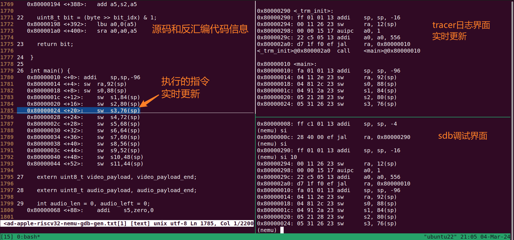

# ysyx-sdb-tui

A simple tui used for sdb in the ysyx project's nemu or npc.

## 特点

- 低依赖，只需要按照极少依赖即可运行
- 模块化，独立模块，提供了对外的几个接口，只需要修改少量源码即可运行
- 高性能，此工具几乎不会影响你正常运行程序，唯一的损耗是程序在调试时需要添加 `-ggdb`和开启 `O1`优化

## 使用指南

以下均在 `Ubuntu 22.04` 环境下测试成功，其他版本未知。

### 实现方法

1. 编译AM程序的时候添加 `-ggdb`以增加调试信息
2. 使用Python解析ELF文件，并生成GDB命令列表文件
3. GDB执行命令并生成包含源码和反汇编代码信息的文件
4. 使用 `vim`的 `remote`功能创建vim服务器
5. NEMU在作为客户端给vim服务器发送命令并执行
6. NEMU通过让vim服务器加载vim脚本方式定位和高亮
7. （可选）使用 `tmux`所带来的福利自动分割和启动窗口

### 安装依赖

- `apt install vim-gtk`以使得 `vim`支持 `clientserver`，使用 `vim --version | grep clientserver` 查看是否有 `+clientserver`
- `apt install gdb-multiarch` 以支持RISC-V的 `gdb` 功能，注意，非Ubuntu用户可能使用其他的 `gdb` 工具链
- `pip(3) install pyelftools` 以使得Python可以解析ELF文件
- 其他依赖，欢迎补充

### NEMU

1. 将 `disasm-autojump.c` 和 `disasm-highlight.vim`放在NEMU的 `utils`目录下（放别的地方也可以，无影响）
2. 在 `Kconfig`合适的位置添加 `VIM_AUTO_JUMP`
3. 在 `init_monitor`函数的 `longimg_size=load_img();`之后合适的位置声明和调用 `disasm_init_vim_script(cpu.pc)`
4. 在 `execute`函数中的 `for` **循环体结束后**添加  `disasm_pos_and_hl(s.pc)`

> [!WARNING]
> $\color{red}{请不要}$把 `disasm_pos_and_hl()`函数放在 `trace_and_difftest` 中，这样会大量执行 `system()` ，这可能导致你的操作系统产生损坏！

### AM
